# iGRP Process – Delegate Configuration and Usages

## 1. Overview

In iGRP Process configuration, Service Tasks play a central role in automating actions within a workflow. These tasks can be enhanced using delegates, which are expressions that define how specific operations—such as webhook calls, JSON parsing, email sending, or message dispatching to brokers like Kafka—are executed.
Each delegate expression corresponds to a specific implementation logic. For example:
*	Webhook Delegate (`${igrpWebhookDelegate`}): Used to send HTTP requests to external services.
*	JSON Parser Delegate (`${igrpJsonParseDelegate}`): Parses raw or Base64-encoded JSON data.
*	Email Delegate (`${igrpSendEmailDelegate}`): Sends emails based on configured parameters.
*	Message Broker Delegate (`${igrpMessageBrokerSenderDelegate}`): Sends messages to Kafka or other message brokers.
These delegates allow dynamic and flexible integration with external systems, enabling data exchange, notifications, and event-driven communication within the process flow. Proper configuration of parameters and variable mapping ensures that data is correctly handled and passed between tasks.

## 2. Walkthrough

### 2.1 Scenario and Cases

This section outlines practical scenarios where delegates are used to perform specific actions:
•	Webhook Call Scenario: A service task sends a request to a "Users" endpoint. The response is stored in a variable (e.g., `testeData`) and specific fields are extracted using dot-notation or array indexing. These fields are then mapped into a payload for a subsequent webhook call.
•	JSON Parsing Scenario: A JSON string (either raw or Base64-encoded) is parsed using the JSON parser delegate. The result is stored in a variable (e.g., `parsedData`) and can be accessed directly or used in expressions for further processing.
These scenarios demonstrate how data flows between tasks and how delegates facilitate external communication and data transformation.

### 2.2 Steps

Here’s a clear breakdown of the steps involved in configuring and using delegates in service tasks:

1. Design your process

2. In a ‘Service Task’ type, you must define an ID for it, because it is very important to fetch execution result data in a variable that is set in the process instance. To use a webhook call, the delegate expression is `${igrpWebhookDelegate}`.

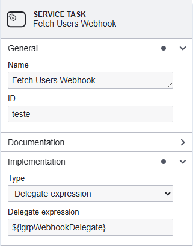

3. The available parameters for this delegate can be found in the table in attachment page. The required ones are `webhookUrl` to indicate the endpoint that should be called, and the `webhookMethod` to indicate the method of the request

4. To fetch data from the previous service task, the response is saved in a variable called `<task-id>Data` (`testeData` in this scenario). The data in this variable can be accessed using dot-notation for objects, and through index elements for arrays, as presented in the configuration below

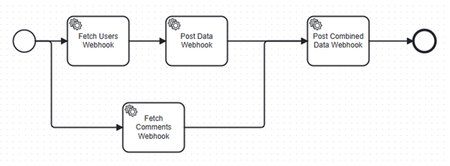

This is the data fetched from Users webhook array that we want to map, and the goal is to attempt to fetch some fields in the response and send it to the Post Data Webhook:

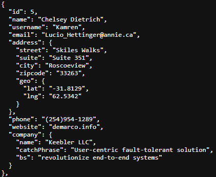

For that to happen, in the `webhookPayload`, using type expression, the use of notations allow to access the data value within the response

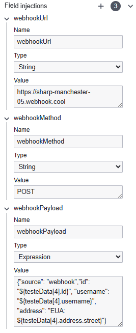

After this step execution, below there’s the result for the webhook call, and it can be verified that the data were correctly mapped into the payload.

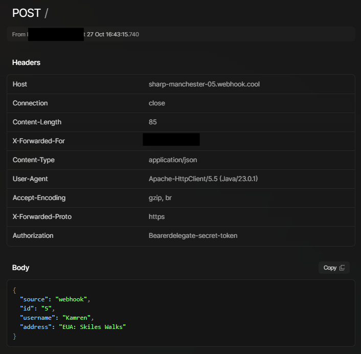

To use the JSON parser delegate, the delegate expression is `${igrpJsonParseDelegate}`. It supports both raw JSON, and base 64 encoded JSON, controller by a boolean parameter (`isBase64Encoded`).

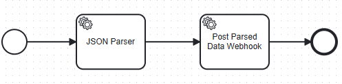

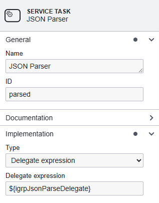

In this scenario, it will be encoded a JSON body

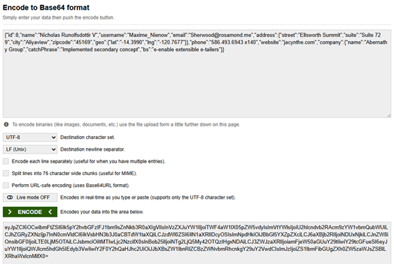

Then in the parameter `json`, the value can be set as a String, with no need for String normalization (like usages of \"id\" ...) or it can be indicated the encoded base 64 string. When it is a encoded JSON, the parameter `isBase64Encoded` must be set as `true`.

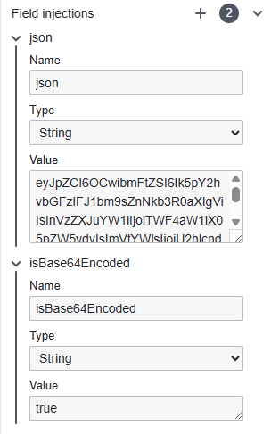

Then the result is set in the variable `<task-id>Data` (`parsedData`), and then you can use it has an expression, pass the whole data, or access specific fields as shown in the webhook case.

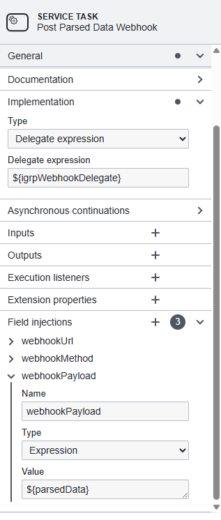

The result is shown below:

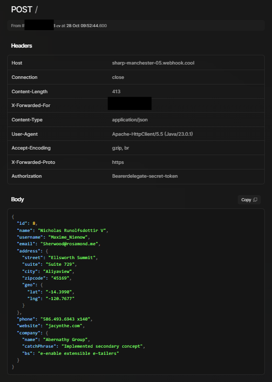

5. To send emails, the delegate expression is `${igrpSendEmailDelegate}`.

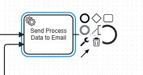

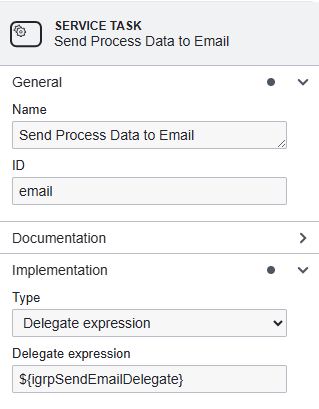

Then set the values to configure the email destination, subject, content and sender

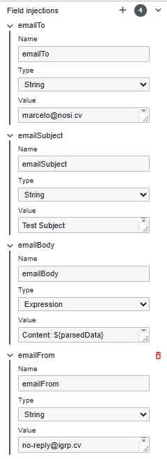

Then on the step execution the email is sent according to the step configuration

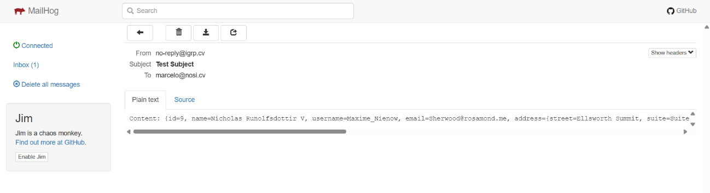

6. To send process data to a message broker, the delegate expression is `${igrpMessageBrokerSenderDelegate}`.

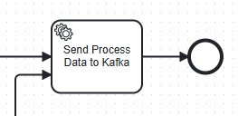

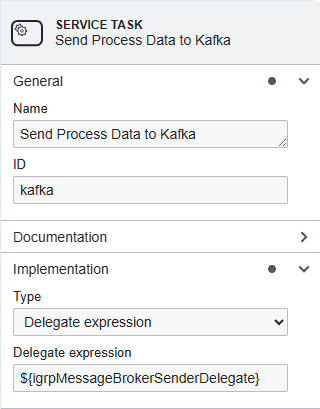

Then indicate the topic in the message broker that the message should be sent to through the variable `topic`

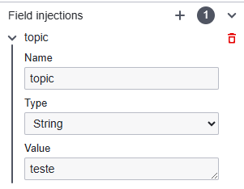

Then on the service task execution it will send the process data to the message broker, as indicated below:

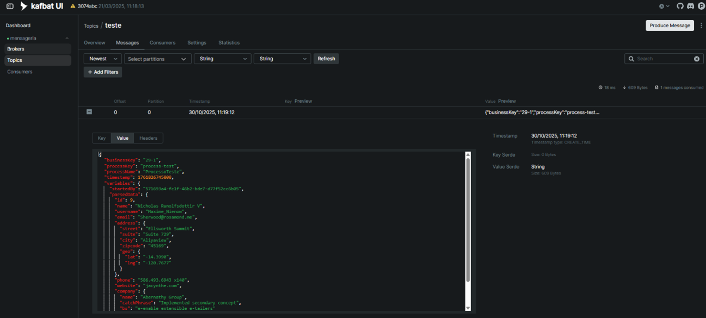

If you don’t have a message broker available, an alternative is to use `${igrpProcessWebhookDelegate}`. It does the same thing as the message broker delegate, but through webhook. You only need to provide the URL (required), path and headers (if they are present). On execution, it triggers an HTTP POST request with the process data as payload to the provided URL with the provided headers

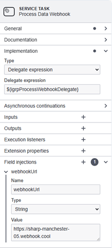
