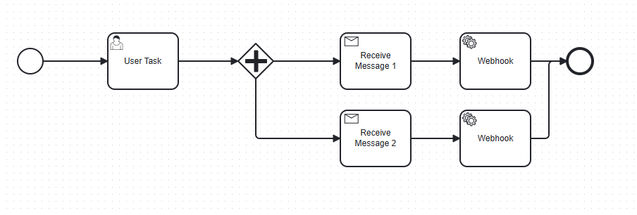
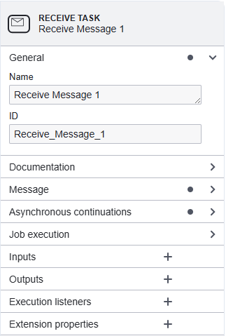
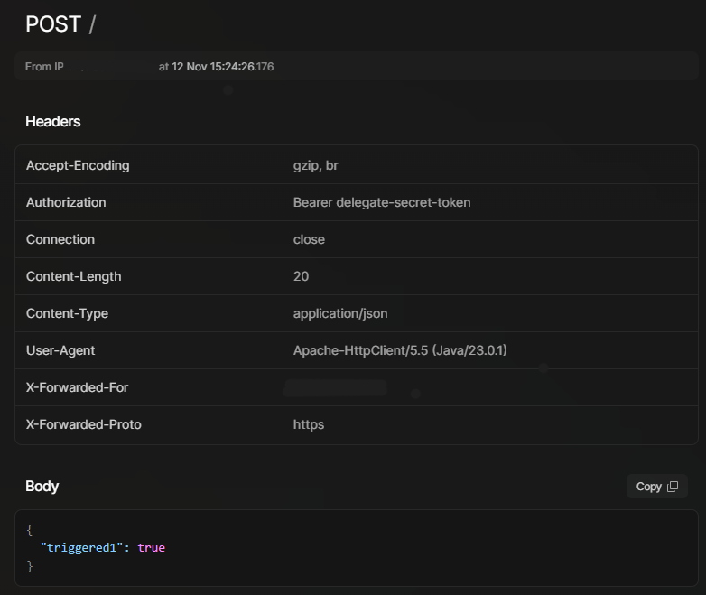
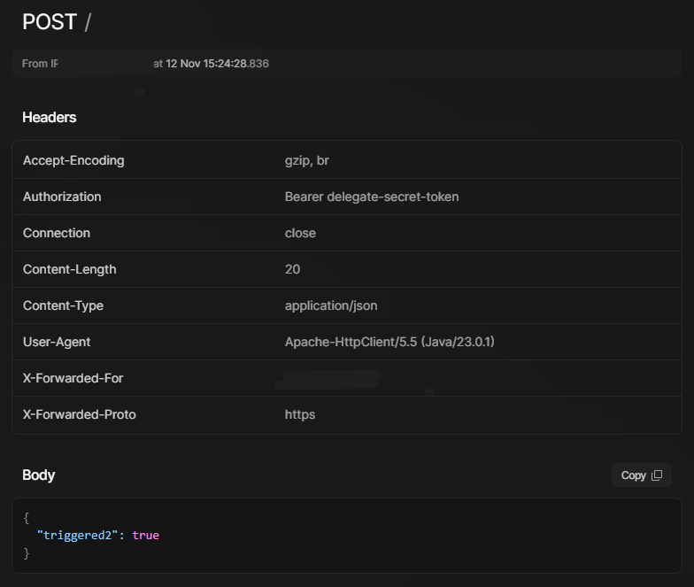
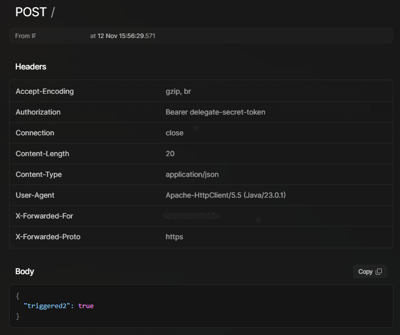

# iGRP Process – Events Configuration and Usages

## 1. Overview

In iGRP Process configuration, Receive Tasks play a central role in handling events within a workflow. These tasks can be useful for:
*	Waiting for external triggers or signals.
*	Processing incoming data from message brokers.
*	Handling webhook requests.

## 2. Walkthrough

### 2.1 Scenario and Cases

This section outlines practical scenarios where receive tasks are used to perform specific actions:
•	Webhook Call Scenario: A service task sends a request to an endpoint when the signal is received by the receive task.
These scenarios demonstrate how to configure a receive task to wait for an external signal and then trigger a service task to perform an action.

### 2.2 Steps

Here’s a clear breakdown of the steps involved in configuring and using receive tasks:

1. Design your process



2. In a ‘Receive Task’ type, you must define an ID for it, because it is very important to signal the specific execution of the process instance, if multiple receive tasks are used in the process, specially in the parallel gateways cases.



There is a service task that will be triggered when the signal is received by the receive task. This is just to showcase the behaviour when the signal is received without an ID and when the signal is received with an ID.

3. There are two ways to signal the receive task: through a message broker or through API:
* Through a message broker, when the process event data is published to the topic `igrp-process-events` the receive task is triggered, according to the configuration provided in the message structure. The message must be a JSON object with the following structure:

```json
{
  "messageName": "Message_Teste", // optional: if provided, a correlate message is send. This is used usually for Message Immediate Catch Events
  "taskId": "Receive_Message_2", // optional: if not provided, the current awaiting receive task in the workflow will be triggered
  "businessKey": "45-1",
  "variables": {
    "varReceive": "value1",
    "varTeste": 123
  }
}
```

* Through an API, the endpoint `/process-instances/event` is used to signal the receive task. The payload must be a JSON object, with the following structure:

```json
{
  "messageName": "Message_Teste", // optional: if provided, a correlate message is send. This is used usually for Message Immediate Catch Events
  "taskId": "Receive_Message_2", // optional: if not provided, the current awaiting receive task in the workflow will be triggered
  "businessKey": "45-1",
  "variables": [
    { "name": "varReceive", "value": "value1" },
    { "name": "varTeste", "value": 123 }
  ]
}
```

3. When a task ID is not provided, in the parallel gateway case like in this scenario both receive tasks are triggered, and the webhook service tasks are both executed.





4. In the case a task ID is provided (`Receive_Message_2`), just the receive task 2 is triggered and then the webhook 2 is executed:


